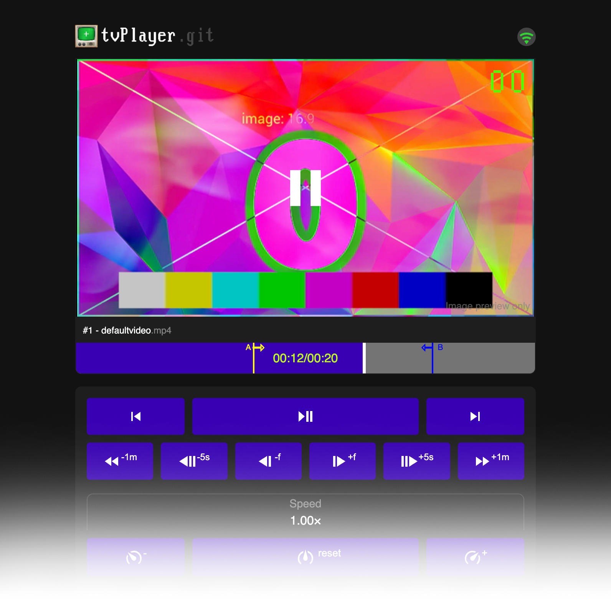

# tvPlayer as digital props for film and TV
This is basically a media player.

Power it and it will play the first image or video on the USB stick.

You can control the playback by keyboard or via a locally served website from your mobile device.
Change aspect ratios, colors and playback speed, "change the channel"; now you have an interactive TV station and your actor or actress always watches what is in the script.

Fill a USB stick with video (or *image!*) files; plug it in; have a fake TV.
Channel number is shown when switching them, white noise is shown when nothing is available and the volume bar is there for you when you expect it. Both can be turned off on-the-fly.

# What you can do
- You can set inpoints for each video, so when you switch channels, it starts directly at the key moment, like when the journalist says, "*...some minor accident today in the hospital of Dunwich was contained and we have nothing to worry about. Now to the weather..*"
- You can turn the TV fake-off ("blackout").
- You can switch video-fitting-mode from contain to stretch to cover, to get rid of potential letterboxes.
- Control saturation/brightness/contrast
- Control playback speed
- Set inpoints on each video, so the video plays from that point whenever you select the video
- Loop: Set in- and outpoints to be looped
- Zoom and pan video
- You can turn off the fancy effects. 
- The files do not auto-progress from one to another. Each video loops itself until you "switch the channel" (play the next file on the USB device).
- Change the brightness of the video to match exposure times of the camera.
- If everythings lost, theres a [green screen](assets/greenscreen/) button
- Control the playback with the webremote from your mobile device

# Webremote
Once booted, connect your mobile device to the SSID `tvPlayer` and visit `http://10.3.141.1:8080`.

> See full screenshot [here](assets/webremote.png)

# Hardware
Tested successfully on Raspberry 4 (Debian bullseye).

Raspberry pi 3 (Debian Bookworm 32bit) did ***not*** work. Very stuttery but very plausibly i'm doin something wrong.

Combine it with a [HDMI-to-RCA](https://www.amazon.de/QGECEN-Cinch-Adapter-Konverter-Kabel/dp/B09JVHHXMV/) adapter **and** a [RCA-to-RF](https://aliexpress.com/item/1005002132207554.html) adapter to display on an old TV. Even sound works!

## Get this up and running
1. Clone this repo `git clone https://github.com/falue/tvPlayer`
2. run the install script `sudo bash install.sh` to: *THIS IS NOT YET FINALIZED*
    - apt-get update
    - install dependencies (Packages: *mpv*, *socat*, *wmctrl*; Python: *pygame*, *natsort*)
    - auto-run `python3 autostart.py` on autostart[*]
    - ~~disable window "removable medium is inserted"~~ [BUG!]
    - create a desktop shortcut to the program
3. Set **audio output** to HDMI (right click on audio in toolbar, choose HDMI)
4. disable pop up window "**removable medium is inserted**": Open any folder > `Edit` > `Preferences` > `Volume Management` > uncheck `Show available options for removable media when they are inserted`
5. Insert USB, start watching TV.
6. Connect your mobile device to the SSID `tvPlayer` and visit `http://10.3.141.1:8080`.

> [*] The `autostart.py` script asks if you want to close all other autostarting windows and after a 12s timeout, it starts the main script `tvPlayer.py`. This is because other windows can overlap the tvPlayer and hinder the fullscreen mode. So without a keyboard and doing anything, the player goes to fullscreen on startup.

# File handling
## MPV player: Playable media
The media player [MPV](https://mpv.io/) ([doc wiki](https://github.com/mpv-player/mpv/wiki)) used here can play pretty much everything -
*however*, filename-endings are fixed to work with `.mp4`, `.mkv`, `.avi`, `.mxf`, `.m4v` and `.mov` (case insensitive).

It uses ffmpeg to decode, so the [list of playable media](https://ffmpeg.org/general.html#Supported-File-Formats_002c-Codecs-or-Features) is huge.
According to the mpv.io website:
> File Formats: mpv supports a wide variety of media formats, including popular video files (e.g., MP4, MKV), audio codecs (e.g., AAC, MP3), and subtitles.

Some cherry picked examples:
> - Containers: MP4, MKV, AVI, WebM, OGG, FLV, and more.
> - Video Codecs: H.264, HEVC, VP8, VP9, AV1, MPEG-4, MPEG-2, and others.
> - Audio Codecs: AAC, MP3, Vorbis, FLAC, Opus, AC3, and DTS.
> Subtitle Formats: SRT, ASS, SSA, VTT, and embedded subtitle tracks in containers like MKV.

Manually tested:
- [x] `.mp4` MPEG-4 AAC, H264
- [x] `.avi` MPEG-4 mp3
- [x] `.mkv` h264, yuv420p
- [x] `.mxf` mpeg2video (4:2:2), yuv422p
- [x] `.mp4` HEVC, H265
- [x] `.mov` H264
- [x] `.mkv` "4k UHD" h264 yuv420p works (but stuttering on raspberry pi4 @8gb) 

## Also works with *images*!
Filetypes for images: `.jpg`, `.jpeg`, `.png`, `.gif`, `.tiff`, `.bmp`.

> *NOTICE:* `.png` does ***not*** work with color mode: "*indexed colors*"!

## USB drive format
Works with `FAT32` and `EXFAT` formatted USB drives.

Does not work with MAC formatted drives.

## Filenames, TV channel order and AV channel
The order of the files on the USB device lead the order of the TV channels.

The alphabetically first file (case insensitive, numbers before letters) is the first channel, etc.

If you want to change the order, rename the files approprietly.

> *TIP:* If any file name starts with `AV.`(mp4 or any other) its always the channel "zero" and the channel number is shown as **"AV"**.

## Channel number and volume bar styling
If you want to change the appearance of the channel numbers or the volume bar, you have to update the `.bgra` files in `/channel_numbers` and `/volume_bars`.

You can edit the pngs and convert them to `.bgra` files. Change the variable `input_folder` in it first, and then run bash script `python3 png_to_bgra.py` to convert the files.

> *Note*: For simplicity, keep the image sizes the same as they are hard coded. Otherwise you have make changes to the script (change the parameters of both `display_image(...)` instances)

### Transparency
Complete black pixels will become transparent.
If you want "black" to show up, use `rgb(1,1,1)`.

# Keyboard controls

| Keypress        | Action                                   | Note |
| --------------- | ---------------------------------------- | ---- |
| LEFT            | prev channel                             | aka "previous file" on USB drive (alphabetically) |
| RIGHT           | next channel                             | aka "next file" on USB drive (alphabetically) |
| [number]        | go to channel nr [number]                |      |
| UP              | jump +5 seconds                          |      |
| CTRL + UP       | jump +60 seconds                         |      |
| SHIFT + UP      | pause and jump one frame forwards        |      |
| DOWN            | jump -5 seconds                          |      |
| CTRL + DOWN     | jump -60 seconds                         |      |
| SHIFT + DOWN    | pause and jump one frame backwards       |      |
| p *or* space    | toggle play / pause                      |      |
| ESC             | toggle fullscreen                        |      |
| q               | shutdown raspberry pi                    |      |
| Q (SHIFT+q)     | exit program                             |      |
| b               | toggle black screen on or off            | Also pauses the current video when entering black screen, resumes video when exiting black screen      |
| g               | toggle green screen                      | Available [chroma screens](assets/greenscreen/): Green, Blue, Black, Grey, White Each with 3 different tracking marker arrangements and one without. |
| G (SHIFT+g)     | cycle through green screens →           |      |
| CTRL + g        | cycle through green screens ←           |      |
| c               | video fitting                           | "Contain", "stretch" or "cover" |
| i               | set inpoint                             | Set where this video starts to play when chaning channels |
| I (SHIFT+i)     | clear inpoint on this video             |      |
| o               | set outpoint                            | Set where this video ends (loops back to inpoint) |
| O (SHIFT+o)     | clear outpoint on this video            |      |
| a               | toggle tv GUI on or off                 | Show green channel numbers and volume bar |
| w               | toggle white noise on or off between channel changes |      |
| W (SHIFT+w)     | cycle through 4 different white noise effects | Also activates white noise between channel change and shows current white noise selection |
| j               | decrease playback speed                 | Min. 0.01&times; |
| k               | normalize playback speed                |      |
| l               | increase playback speed                 | Up to 3&times; |
| x               | pan video to the right                  |      |
| X (SHIFT+x)     | pan video to the left                   |      |
| y               | pan video downwards                     |      |
| Y (SHIFT+y)     | pan video upwards                       |      |
| CTRL + x (or CTRL + y) | reset pan                        |      |
| .               | zoom out                                | Bug: Does not scale channel number, volume images properly |
| SHIFT + .       | zoom in                                 | Bug: Does not scale channel number, volume images properly |
| CTRL + .        | zoom reset                              |      |
| ,               | reduce video brightness by 5%           |      |
| SHIFT + ,       | increase video brightness by 5%         |      |
| m               | reduce video contrast by 2.5%           |      |
| SHIFT + m       | increase video contrast by 2.5%         |      |
| n               | reduce video saturation by 2.5%         |      |
| SHIFT + n       | increase video saturation by 2.5%       |      |
| +               | reduce volume by 10%                    |      |
| -               | increase volume by 10%                  |      |
